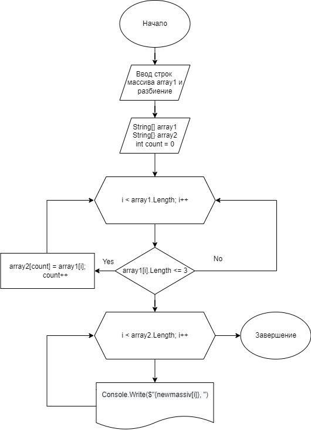

# Итоговая проверочная работа по первому блоку обучения.
## Задача : 
Написать программу, 
которая из имеющегося массива строк формирует новый массив из строк, длина которых меньше, либо равна 3 символам. Первоначальный массив можно ввести с клавиатуры, либо задать на старте выполнения алгоритма. При решении не рекомендуется пользоваться коллекциями, лучше обойтись исключительно массивами.
## Описание алгоритма решения:
    1. Первоначальный массив вводим с клавиатуры и разбиваем, используя метод Split.
    2. Второй массив создал пустой, с длиной, равной длине первого массива.
    3. В соответствии с условием задачи отфильтровываем массив двумя циклами 
       и формируем новый массив из строк, 
       длина которых меньше, либо равна 3 символам используя метод FillNewMassiv
    4. Новый массив из строк, длина которых меньше, либо равна 3 символам выводим на экран
      используя метод PrintNewMassiv.
### Блок схема в файле Blockdiagram.png
### Код в папке Task1Project1/Program.cs
### Ссылка на репозиторий в GitHub:
https://github.com/PetrVav/Finish_Blok1.git
## Блок схема алгоритма:

